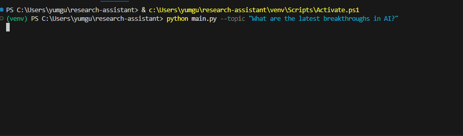

# 🔍 AI Research Assistant

An AI-powered research assistant that searches the web and delivers 
clear, sourced answers through a conversational CLI interface.

## 🎬 Demo


## 🌍 The Problem
Finding reliable, up-to-date information online is time consuming. 
Search engines return dozens of links that still require manual reading 
and synthesis. There is no easy way to have a focused research 
conversation that remembers context and saves results.

## 💡 The Solution
This agent accepts natural language research questions, searches the web 
in real time, synthesizes findings into clear bullet points with sources, 
remembers conversation context, and saves every result to a timestamped file.

## 🛠 Tech Stack
- **LLM:** Anthropic Claude (claude-sonnet)
- **Agent Framework:** LangChain
- **Search Tool:** Tavily API
- **Language:** Python 3.11

## ⚙️ Setup Instructions
'''

1. Clone the repository
 ```bash
   git clone https://github.com/CHRISTIANSEBO/research-assistant.git
   cd research-assistant
```

2. Create and activate a virtual environment
```bash
   python -m venv venv
   venv\Scripts\activate
```

3. Install dependencies
```bash
   pip install -r requirements.txt
```

4. Add your API keys — create a .env file in the root folder
```
   ANTHROPIC_API_KEY=your_key_here
   TAVILY_API_KEY=your_key_here
```

5. Run the agent
```bash
   python main.py
```

'''

## 📁 Project Structure

research-assistant/
├── .env
├── .gitignore
├── requirements.txt
├── main.py
└── agent/
    ├── __init__.py
    ├── tools.py
    ├── assistant.py
    └── file_handler.py
```

'''

## ✨ Features
- Conversational memory across the session
- Real-time web search with cited sources
- Auto-saves research results to timestamped files
- Clean CLI interface
- Error handling for API failures and missing keys
- `--topic` flag for immediate research from command line

## 🔮 Future Improvements
- Web UI using Streamlit
- Support for multiple search tools
- Export results to PDF or DOCX
- Multi-agent collaboration
